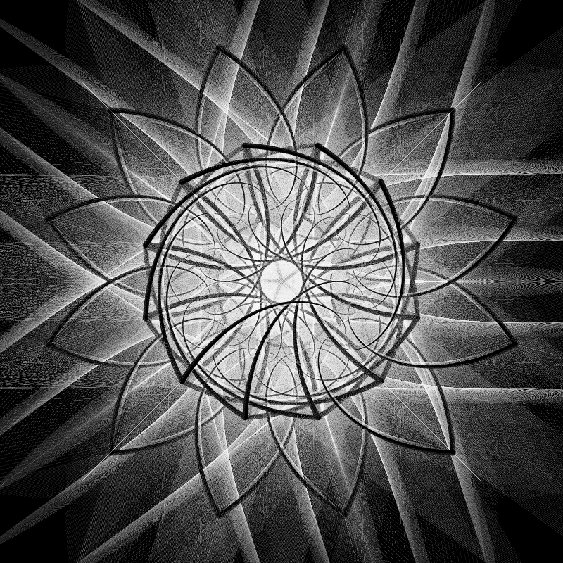

# Xylo &emsp; [![License]][github.com] [![Latest Version]][crates.io] [![Docs]][docs.rs]

[License]: https://img.shields.io/badge/license-MIT%2FApache-blue.svg
[github.com]: https://github.com/giraffekey/xylo/blob/main/LICENSE
[Latest Version]: https://img.shields.io/crates/v/xylo-lang.svg
[crates.io]: https://crates.io/crates/xylo-lang
[Docs]: https://docs.rs/xylo-lang/badge.svg
[docs.rs]: https://docs.rs/xylo-lang/latest/xylo_lang/index.html

A functional programming language for generative art.



## Example

```ocaml
root =
    l 0 FILL : ss 400 bouquet

quality = 1000

bouquet =
    r 36 (ss 1.3 flower5)
    : r 15 flower6

flower6 =
    demiflower6
    : flip 90 demiflower6

flower5 =
    demiflower5
    : flip 90 demiflower5

demiflower6 =
    collect (
        for i in 0..12
            r (i * 30) (petal6 quality))

demiflower5 =
    collect (
        for i in 0..5
            r (i * 72) (petal5 quality))

petal5 i =
    if i == 0
        EMPTY
    else
        s 1 0.0001 SQUARE
        : ss 0.005 (tx -0.5 (l 0 CIRCLE))
        : tx 0.5 (r 144.04 (ss 0.998 (tx 0.5 (lshift (1 / quality * 0.6) (petal5 (i - 1))))))

petal6 i =
    if i == 0
        EMPTY
    else
        s 1 0.0001 SQUARE
        : tx -0.5 (ss 0.01 (l 0 CIRCLE))
        : tx 0.5 (r 120.21 (ss 0.996 (tx 0.5 (lshift (1 / quality) (petal6 (i - 1))))))
```

## Installation

### Released Builds

You can find the latest release of the Xylo binaries [here](https://github.com/giraffekey/xylo/releases/latest).

### Cargo Install

You can install Xylo using Cargo:

```sh
cargo install xylo-lang
```

### Manual Build (Linux)

Clone the repo:

```sh
git clone https://github.com/giraffekey/xylo
```

Build the repo:

```sh
cargo build --release
```

Copy the CLI:

```sh
sudo cp target/release/xylo-lang /usr/bin/xylo
```

## Usage

Write some Xylo code in a `.xylo` file e.g. `art.xylo`.

Then, generate an image from that code:

```sh
xylo generate art.xylo --width 800 --height 800
```

If your code is valid, you should see an image output to `art.png`.
